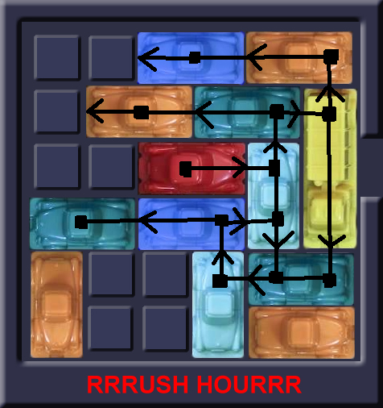
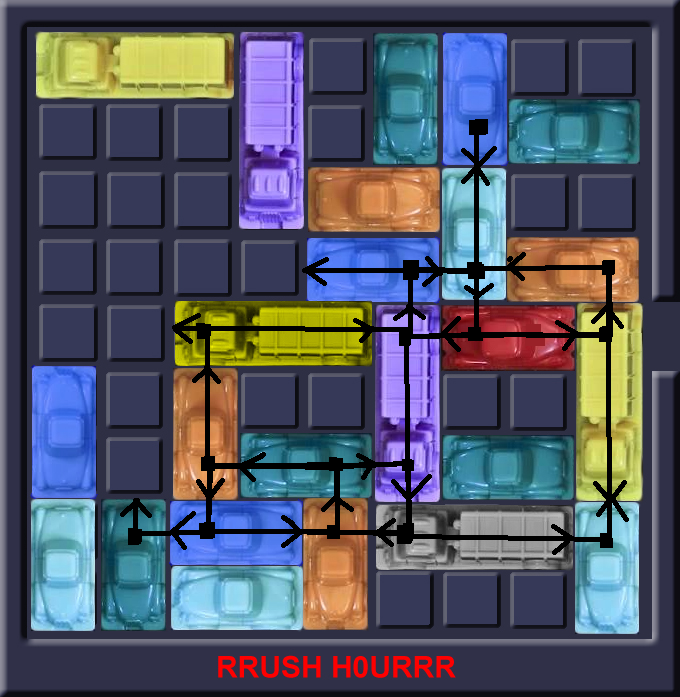

# Advanced

**Intro**  
The goal in Rush hour is to escort the red car to the exit. This is done on a standard board of size 6x6 or in this case also on boardsizes of 9x9 and 12x12. The difficulty in this game is caused by the other cars on the board. There are vertical and horizontal cars, who together block the red car's way to the exit.

**Obstacle chain**  
Every car directly in front of the red car is what we call a start of a chain of obstacles. This works as follows: The red car is blocked by another car. If this car could move, the obstacle would be gone. However, in many cases this car is again blocked by another car and so forth. Every next car would be a new link in the obstacle chain. From the end of such a chain all cars can be moved so that the red car can move, this would mean that chain is solved. Unfortunately, with large boardsizes there are much more cars that belong to the same or even multiple obstacle chains. This creates loops that are hard to break through.

**Size of the board**  
The size of the board is not immediately a reason for a more difficult game. It doesn't really matter if you have 6x6, 9x9 or 12x12 board as long as there are no cars in front of the red one. However, the size of the board does influence the length and complexity of the obstacle chains. The more space is available, the more cars can block eachother and with that, lengthen the chain. Also, on a larger board it is more likely that obstacle chains get tangled, and create more loops.

**Amount of cars**  
The amount of cars is, as was just said, not immediately a problem for solving the case. This is true under the condition that the cars do not block the red car. In case the cars do block the red car, every car directly in front of the red one, is what we see as the start of a chain. In most cases, the more obstacle chains, the more complicated the game is.

**Freedom of the red car**  
In many gameboards there are no horizontally moving cars on the red car's row. A horizontal moving car, can never be an obstacle for the red car, because it can never move out of the way. What a horizontal moving car can do however, is restrict the possible moves the red car can make. The less movements the red car is able to do, the less obstacles can be in front of the red car. This will ultimately make the game easier to solve.

**Algorithm against human**  
The gameboards that we've generated ourselves can most of the time be solved in under 5 steps by a human. This is because we shuffle a self-generated solved board with random moves. Most often, this doesn't create very complicated obstacle chains. Surprisingly though, when we let our algorithms try to find the solution, it seems pretty difficult. This is because the algorithms only look at how many board-configurations are possible, while us humans look at which cars should move to move the red car to the exit. So while a human finds it far more difficult when everything blocks eachother, for algorithms it seems to have to do with the amount of different board-configurations.

**Conclusion**  
The amount of cars and boardsize alone don't have a large influence on the difficulty. The moment that these cars start blocking the red car and eachother, the game becomes much more complex. Depending on the size of the board, the amount of cars and the freedom of movement of the red car, the chains that appear can become increasingly more extensive and more complicated (An example of this is shown in Figure 1 and 2.). According to us, this is what makes a RushHour game much harder.

Concerning the difficulty for algorithms the cause is a bit different. With algorithms we see that a board that is solvable in 3 steps can still be very hard. The cause for this is the freedom of movement for all cars. The more freedom a car has, the more board-configurations are possible. This increases rapidly, which means that time it takes for an algorithm to achieve a solution can be pretty long.

---

    <figure style="display: inline-block;">
        
        <figcaption>Fig.1 6x6 obstacle chain</figcaption>
    </figure>
    <figure style="display: inline-block;">
        
        <figcaption>Fig. 2 9x9 obstacle chain</figcaption>
    </figure>

