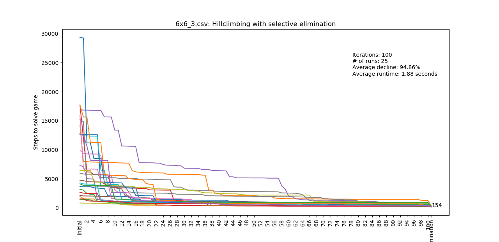
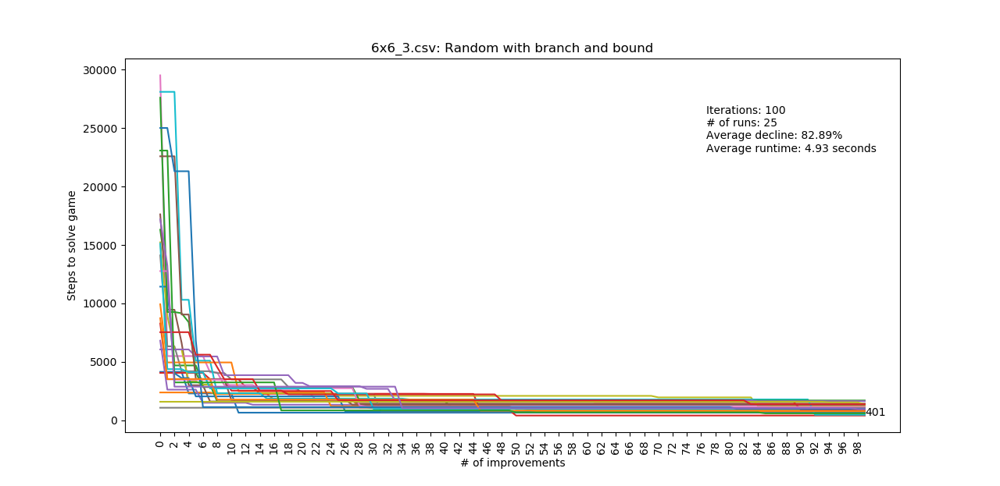

# Algorithms

The algorithms folder contains the algorithms that can be used to solve a Rush Hour board. This file explains them briefly.

## Random

### Pure random

The algorithm randomly picks a car on the board, then checks how far the car can move forwards or backwards and picks a random number in this range. This is repeated until it finds the solution.

### Constraint random

This algorithm applies a heuristic to improve the random. If the red car has a free way to the exit, it is forced to move there.

An advantage of the random algorithms is that they find a solution quickly. A large disadvantage of the random algorithms is that you can never know if a solution is the shortest possible.

### Branch and bound random

This algorithm builds upon the constraint random. It runs that algorithm multiple times, keeping track of the shortest solution. If a next iteration uses more steps than this known shortest solution, the iteration is stopped. The advantage of this heuristic is that you randomly walk towards the best solution. This results in a better estimation of the best solution instead of completely random solutions.

---

## Hillclimb

Our hillclimb algorithm is focused on improving an already existing outcome. First, we take a random solution. Then the algorithm will start at the beginning again, and will try to improve this solution. To do this, the algorithm tries to find a boardstate further in the solution faster than it did before. The algorithm uses random moves to achieve a boardstate that appears further in the original solution. The algorithm will try to improve the current solution a certain number of times
After the improvements we will run a procedure that we call: 'selective elimination'. This procedure checks if a boardstate appears multiple times in the moveset, and then removes everything in between.

An investigation that we did with our hillclimber is finding the optimal amount of improvements in terms of average decline of the solution length, and the runtime.

---

## Breadth First Search (BFS)

The breadth first search algorithm starts with the original board, derives all its children and puts them in a queue. A child is a board that can be created from another board via a single move. The algorithm works with First In First Out, meaning that the next board from which children are generated is taken from the front of the queue. The tree is therefore explored one layer at a time. If a child is found that satisfies the winning condition, the algorithm ends.

This BFS makes use of the archive to optimally prune. If a child is generated that is already in the archive, it is not put in the queue.

The advantage of breadth first is that the solution found is always in the shortest amount of steps. The disadvantage is that the queue grows exponentially, thus it requires a lot of memory to go deep into the tree.

### Beam search

A variation on the BFS is the beam search, in which the amount of children put in the queue is constrained. In our case, the selection of children happens randomly, as we could not think of an explicit way to measure if one move brings the board closer to a solution than another move.

An advantage of beam search is that the queue grows more slowly, thus it can go deeper into the tree. A disadvantage is that if a solution is found, it cannot be guaranteed that it is the shortest solution possible. The higher the beam, the more this algorithm behaves like normal BFS.

---

## Depth First Search (DFS)

A depth first search algorithm starts with the original board, derives all its children and puts them on a stack. The next board to have its children analyzed is the last in line of the queue, thus the algorithm works with the Last In First Out principle. Therefore, the algorithm immediately dives deep into one branch of the tree, until it finds a solution or is blocked by a depth limit. Our depth-first algorithm also prunes optimally with the archive.

The advantage of depth first is that this algorithm takes up much less memory (RAM) than breadth first. A disadvantage is that the case on which the algorithm is used needs to have a "deepest point". We have implemented two variants of DFS:

### Branch and Bound

Much like the random branch and bound, this branch and bound limits the depth to the best found solution. The problem is the initial depth limit choice. The closer this choice is to the shortest solution, the quicker it will come to this solution. We have it set to 30, since we found that all boards except 6x6_3 can be solved within 30 steps. To still be able to solve 6x6_3, the depth limit is increased by 5 every time the solution cannot be found within the limit.

### Iterative deepening

Iterative deepening combines breadth first search with depth first search. It is a depth search in which the depth limit starts at 1 and is increased by 1 after every unsuccessful round. 

Advantages of these depth first algorithms are that they always find the best solution, and that they use way less memory than BFS. However, they are slower than BFS, because they have to repeat a lot of work they already did.

---

# Results overview

For four of the seven algorithms, figure 1 below shows solutions that can be generated with our algorithms. It should be noted that the beam searches have a random element, so if you run our programme, the results could differ. These bars do show that iterative deepening and beam search always find the same answer, given enough time. As you can see, 9x9_6 and 12x12_7 have not been solved by these four algorithms.

The other four algorithms have undergone changes on monday (27-01-2020) and tuesday (28-01-2020), so the definitive results are not yet available for all boards. The figures will resemble the ones below. The upper one shows the results of hillclimbing on 6x6_3 board 25 times with 100 iterations each time. Under this, the result of 25 runs of the random branch and bound are shown. These plots, and the future results of the other boards will be similar and can be compared.

