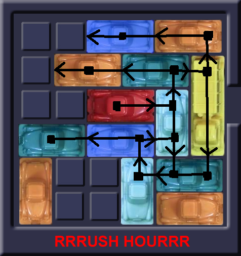
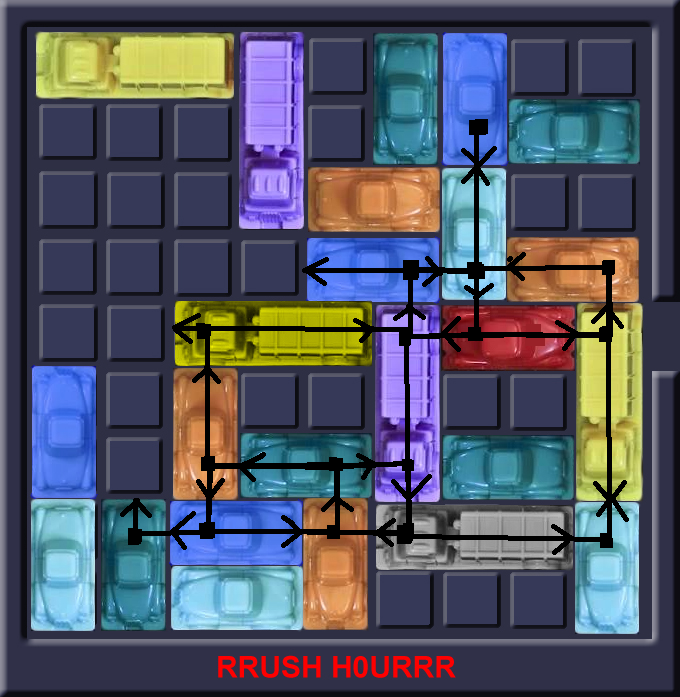

# Advanced

**Intro**  
The goal in Rush hour is to escort the red car to the exit. This is done on a standard board of size 6x6 or in this case also on boardsizes of 9x9 and 12x12. The difficulty in this game is caused by the other cars on the board. There are vertical and horizontal cars, who together block the red car's way to the exit.

**Obstacle chain**  
Every car directly in front of the red car is what we call a start of a chain of obstacles. This works as follows: The red car is blocked by another car. If this car could move, the obstacle would be gone. However, in many cases this car is again blocked by another car and so forth. Every next car would be a new link in the obstacle chain. From the end of such a chain all cars can be moved so that the red car can move, this would mean that chain is solved. Unfortunately, with large boardsizes there are much more cars that belong to the same or even multiple obstacle chains. This creates loops that are hard to break through.

**Grootte van het bord**  
De grootte van het bord is niet direct een reden waardoor het spel moeilijker zou worden. Of je nou een 6x6, een 9x9, of een 12x12 hebt, zolang er geen auto’s in de weg van de rode auto staan is elk bord even makkelijk. De grootte van het bord heeft echter wel invloed op de lengte en complexiteit van de obstacle chain. Hoe meer ruimte er is op het bord, hoe meer auto’s elkaar kunnen blokkeren en zo de ketting kunnen verlengen. Ook zullen hier sneller kettingen met elkaar verstrikt raken en zo meerdere cirkels creëren.

**Aantal auto’s**  
Het aantal auto’s is zoals zojuist genoemd, niet per sé een probleem voor het oplossen. Dit is onder de voorwaarde dat de auto’s de rode auto niet blokkeren. Op het moment dat dit wel het geval is, zien wij elke auto die direct in het pad van de rode auto staat als de start van een ketting. En in de meeste gevallen, hoe meer kettingen, hoe ingewikkelder.

**Bewegingsvrijheid van de rode auto**  
Bij zeer veel van de Rushhour speelborden is te zien dat er geen horizontaal bewegende auto’s op de rij van de rode auto staan. Een horizontaal bewegende auto kan nooit een obstakel vormen voor de rode auto, want deze kan nooit aan de kant. Wat zo’n auto wel doet, is de bewegingsvrijheid van de rode auto sterk verminderen. Hoe minder ver de rode auto heen en weer kan bewegen hoe minder obstakels er op het pad van de rode auto kunnen komen. Dit maakt een bord dus een stuk makkelijker.

**Algoritme tegen mens**  
De borden die ons zelf gegenereerd worden zijn vaak door mensen in een paar stappen op te lossen, we husselen namelijk een opgelost bord en daar ontstaan niet vaak lange obstakel-ketens. Opvallend genoeg is dat als we onze algoritmes de uitkomst proberen te laten vinden, het toch heel lastig lijkt. Dit komt omdat de meeste van onze algoritmes kijken naar de hoeveelheid verschillende bord-configuraties die mogelijk zijn, terwijl wij als mens kijken welke auto’s er weg moeten voordat de rode auto weg kan. Dus terwijl wij als mens het een stuk moeilijker vinden als alles elkaar blokkeert, lijkt het voor verscheidene algoritmes zoals breadth- en depth-first meer te maken te hebben met de hoeveelheid bord-configuraties.

**Conclusie**  
Hoeveelheid auto’s en grootte van het bord hebben op zichzelf niet een grote invloed op de moeilijkheid. Op het moment dat deze auto’s de rode auto en vervolgens elkaar gaan blokkeren, wordt het spel een stuk complexer. Afhankelijk van de grootte van het bord, de hoeveelheid auto’s en de bewegingsvrijheid van de rode auto, kunnen de kettingen die ontstaan steeds uitgebreider en ingewikkelder worden (dit is te zien in Fig. 1 en Fig. 2). Dit is volgens ons wat de moeilijkheid van Rushhour sterk vergroot.

Voor de moeilijkheid van algoritmes ligt de oorzaak echter net wat anders. Daar zien we dat ook al is een bord in 3 stappen op te lossen dat veel algoritmes er nog steeds erg lang over doen. Dit komt door de bewegingsvrijheid van alle auto’s. Hoe verder elke auto op elk moment kan bewegen, en hoe meer auto’s dat kunnen, hoe meer kinderen er zijn per bord-configuratie. Dit loopt flink snel op, en zo kan het dus best even duren voordat bijvoorbeeld breadth-first een bord van 3 stappen heeft opgelost.

---

    <figure style="display: inline-block;">
        
        <figcaption>Fig.1 6x6 obstacle chain</figcaption>
    </figure>
    <figure style="display: inline-block;">
        
        <figcaption>Fig. 2 9x9 obstacle chain</figcaption>
    </figure>

